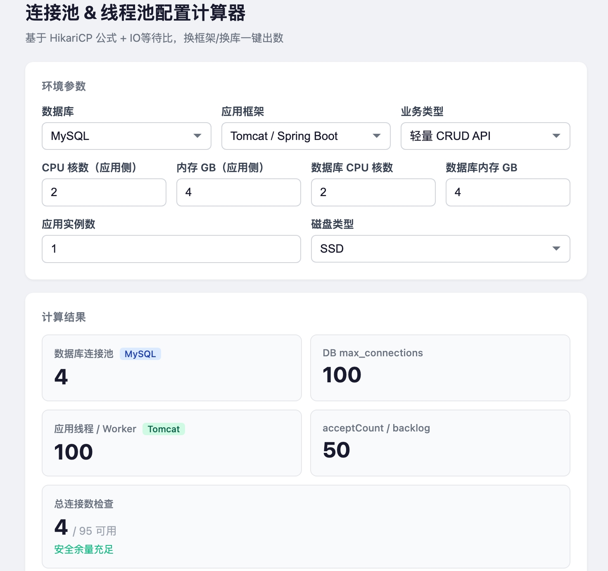

# Connection Pool & Thread Pool Calculator

Live: **[maimai-git.github.io/pool-calculator](https://maimai-git.github.io/pool-calculator/pool-calculator.html)**
<p align="center">
  
</p>

---

## What It Does

Enter your database type, app framework, CPU/RAM, and workload — the calculator outputs:

- Database connection pool size (HikariCP formula + Little's Law)
- DB `max_connections` (MySQL / PostgreSQL)
- App thread / worker count (Tomcat / Hyperf / Go / Node.js)
- `acceptCount` / backlog
- Connection safety check

## Supported Dimensions

| Dimension | Options |
|-----------|--------|
| Database | MySQL / PostgreSQL |
| Framework | Tomcat (Spring Boot) / Hyperf (Swoole) / Go (database/sql) / Node.js |
| Workload | Lightweight CRUD / Mixed reporting / Compute-heavy / External APIs |
| Hardware | App CPU+RAM, DB CPU+RAM, disk type, instance count |

## Core Formulas

- `pool_size = CPU cores × 2 + disk_count` (SSD=0, HDD=1)
- `max_connections = max(min(practical_cap, memory_cap), app_demand + 5)`
- `maxThreads = pool_size × io_wait_ratio` (Tomcat)
- PostgreSQL `max_connections` capped at 250 (without PgBouncer)

## Local Usage

```bash
open pool-calculator.html
```

Pure frontend. No install, no backend.

---

## Research References

- [HikariCP Pool Sizing (Brett Wooldridge)](https://deepwiki.com/brettwooldridge/HikariCP/4.2-pool-sizing-and-performance-tuning) — Official formula: `connections = CPU×2 + disk_count`
- [Connection Pool Sizing with Little's Law](https://www.michal-drozd.com/en/blog/connection-pool-littles-law/) — `pool = QPS × avg_query_duration`
- [PostgreSQL max_connections Performance Impacts (Cybertec)](https://www.cybertec-postgresql.com/en/max_connections-performance-impacts/) — 512 idle connections → 15% TPS drop; recommended ≤300
- [pg-tuning-guide](https://github.com/edisedis777/pg-tuning-guide) — PgSQL formula: `max_connections = (vCPU × 3) × 2`
- [Percona PgSQL max_connections Advisory](https://docs.percona.com/percona-monitoring-and-management/3/advisors/checks/configuration-pg-high-max-connections.html) — Keep max_connections ≤300; use PgBouncer beyond that
- [Go database/sql Production Best Practices (Leapcell)](https://leapcell.io/blog/resource-pooling-in-go-explained) — `MaxOpenConns ≤ 80% × DB max`, `ConnMaxLifetime < DB timeout`
- [Tomcat Performance Tuning (Alibaba Cloud)](https://developer.aliyun.com/article/1681498) — 4-core I/O-intensive: maxThreads 200–300
- [Swoole/Hyperf worker_num Production Config](https://www.php.cn/faq/2493393.html) — `worker_num = swoole_cpu_num() × 2` (I/O-intensive)
